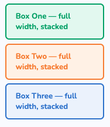
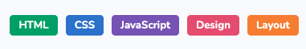
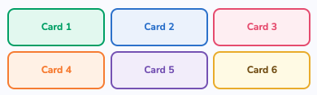
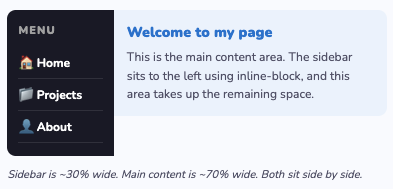
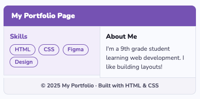

# Div 和 Display 属性练习 — 第一部分

以下是一系列挑战，需要你综合运用我们过去几节课所学的内容：

- Display 属性
- 盒模型属性
- 响应式单位
- 类选择器
- Div 元素

每个挑战将测试你使用 div 创建区块、使用不同的 display 值构建与效果图匹配的布局，以及应用课堂上学过的其他属性的能力。

你的任务是编写 CSS 规则，并将它们应用到 HTML 文件中每个挑战部分提供的 HTML 布局上。请注意，你将会创建很多 CSS 规则 — 确保为每条规则使用不同的类名，否则会出现意想不到的结果。

---

## 参考资料

**Display 属性** — 控制元素在页面上如何渲染的 CSS 属性。常见的值包括 `block`（占据全部宽度）、`inline`（与文本并排显示）和 `inline-block`（并排显示但可以设置宽度和高度）。

**盒模型** — 描述元素所占空间的 CSS 模型。每个元素由四个层次从内到外组成：内容、内边距（边框内的空间）、边框和外边距（边框外的空间）。

**响应式单位** — 相对于其他参照物进行缩放的计量单位，而不是固定大小。例如 `vw`（视口宽度的百分比）、`vh`（视口高度的百分比）、`%`（父元素的百分比）和 `rem`（相对于根字体大小）。

**类选择器** — 使用 `class` 属性在 CSS 中定位 HTML 元素的方式。类在 HTML 中通过 `class="名称"` 定义，在 CSS 中通过 `.名称` 选择。多个元素可以共享同一个类。

**Div 元素** — 一个通用的块级 HTML 元素，用作容器来分组和组织其他元素。Div 默认没有任何视觉样式，通过 CSS 来应用布局和样式。

---

## 挑战 1

> **提示：** 并不是所有的布局都需要用 div 来设置样式。

## 挑战 2

> **提示：** 思考哪些元素共享相同的属性，哪些需要单独的规则。

## 挑战 3

> **提示：** 回想一下你是如何完成上一个挑战的。

## 挑战 4

> **提示：** 思考容器需要什么 display 值，以及容器内每个元素需要什么 display 值才能并排显示。

## 挑战 5

> **提示：** 要匹配效果图，你需要为每个容器设置不同的宽度。你希望所有菜单项垂直堆叠 — 思考哪个 display 值可以防止元素并排显示。

## 挑战 6

> **提示：** 从上到下数一数总共有多少个区块，然后思考如何为每个区块内部设置样式。你需要自己编写 HTML 和 CSS — 没有提供任何框架。